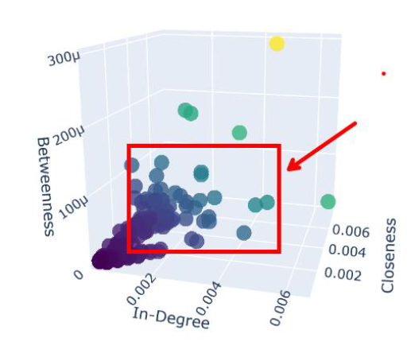

# Brand Analysis Using Twitter: Adidas vs Lululemon

This project combines social network analysis, topic modeling, and sentiment analysis to explore how users interact with the Adidas and Lululemon brands on Twitter.

---

## Objectives

- Identify micro-influencers using network metrics
- Understand dominant themes in brand-related tweets
- Evaluate public sentiment around key topics

---

## Social Network Analysis

User mentions were used to create **directed graphs**, representing the structure of brand-related conversations.

### Influencer Network Graph (Adidas)

*This graph shows influential users in Adidas-related conversations. Mid-tier influencers (1k–10k followers) dominate key positions.*

---

## Topic Modeling (LDA)

Topic modeling was conducted with **Latent Dirichlet Allocation** after cleaning and lemmatizing the tweets. The goal was to uncover recurring themes.

### Adidas Key Topics

*Adidas tweets focused on athletic performance, product launches, and nostalgic sports moments.*

### Lululemon Key Topics

*Lululemon tweets reflected themes like wellness, community, and eco-conscious values.*

---

## Sentiment Analysis

Using the VADER model, tweets were categorized by sentiment polarity (positive, neutral, negative).

### Sentiment Distribution by Brand

*Both brands show predominantly positive sentiment, with Adidas tweets showing more emotional variation.*

---

## Micro-Influencer Recommendations

Two influencers were selected based on centrality and alignment with brand values:

- **Candace Parker (Adidas)** – athlete with high closeness and positive engagement
- **Nicholas Ferroni (Lululemon)** – educator with strong community ties and high betweenness

---

## Recommendations

- Track **temporal sentiment trends** to connect opinion shifts with events
- Use **mid-tier influencers** for authentic engagement
- Enhance sentiment accuracy with **RoBERTa-based models**
