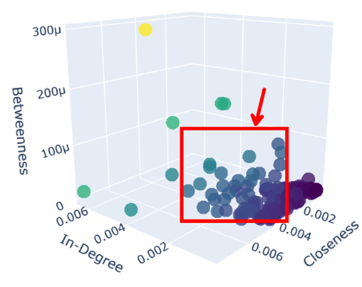
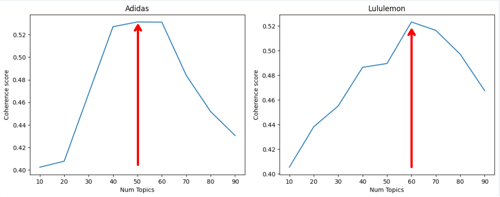
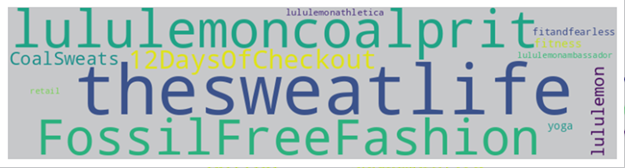

# Brand Analysis Using Twitter: Adidas vs Lululemon

This project investigates how Twitter users interact with two global brands, Adidas and Lululemon. The analysis applies social network techniques, topic modeling, and sentiment analysis to gain insights into user behavior, brand perception, and the structure of online conversations.

---

## Project Objectives

- To identify potential micro-influencers through network centrality metrics
- To uncover dominant themes in brand-related discourse
- To evaluate sentiment trends across different user-generated topics

---

## Social Network Analysis

The initial step involved building directed graphs from user mentions in tweets. Each user was represented as a node, and directed edges were created based on mentions. This allowed the identification of central individuals within the conversation network.

### Influencer Network: Adidas

The graph above illustrates Adidas-related interactions. Many of the most central nodes are mid-tier influencers, with between 1,000 and 10,000 followers. These users were found to be well-connected and organically engaged with their audiences.

---

## Topic Modeling Using LDA

Following text preprocessing, which included cleaning, tokenization, and lemmatization, Latent Dirichlet Allocation (LDA) was applied to extract key discussion themes from each dataset.

### Optimal Number of Topics

To ensure the coherence and interpretability of the topics, several models with different topic numbers were evaluated. The coherence score (c_v) was used to select the optimal configuration for each brand.

The results indicated that 50 topics were optimal for Adidas, while 60 topics were better suited for the Lululemon dataset.

### Key Topics for Adidas

The most prominent topics related to Adidas included product launches, athletic performance, nostalgic sports references, and customer service interactions.

### Key Topics for Lululemon

For Lululemon, dominant topics focused on wellness, sustainability, community engagement, and in-store experiences. This reflects a different audience with lifestyle-oriented values.

---

## Sentiment Analysis

The sentiment of each tweet was classified using the VADER algorithm, which is designed to detect sentiment in informal and short texts, such as tweets. Tweets were labeled as positive, neutral, or negative.

### Overall Sentiment Distribution

The results showed that both brands were viewed positively in general. Adidas tweets, however, demonstrated more variation in sentiment, particularly around customer service topics.

---

## Micro-Influencer Recommendations

Based on their structural positions in the social network and alignment with brand narratives, two micro-influencers were recommended.

- **Candace Parker (Adidas)** – A former athlete frequently mentioned in Adidas discussions. She maintains strong community engagement and relevance in sports culture.
- **Nicholas Ferroni (Lululemon)** – A public educator with high betweenness centrality, often engaged in discussions around wellness, education, and community support.

---

## Conclusions and Recommendations

This study demonstrated how combining network science with natural language processing can reveal important insights into brand perception on social media. The results suggest that:

- Monitoring sentiment over time can help identify moments of change in public opinion.
- Collaborating with mid-tier influencers, especially those embedded in relevant communities, can enhance authenticity.
- Applying transformer-based models such as RoBERTa in future sentiment analysis may yield richer and more context-aware interpretations.
