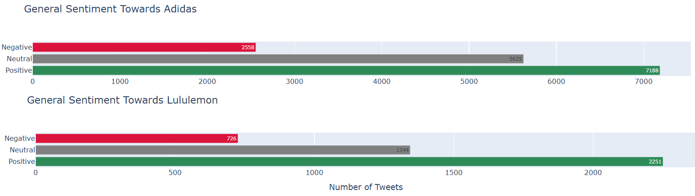

# Brand Analysis Using Twitter: Adidas vs Lululemon

This project combines social network analysis, topic modeling, and sentiment analysis to explore how users interact with the Adidas and Lululemon brands on Twitter.

---

## Objectives

- Identify micro-influencers using network metrics
- Understand dominant themes in brand-related tweets
- Evaluate public sentiment around key topics

---

## Social Network Analysis

User mentions were used to create **directed graphs**, representing the structure of brand-related conversations.

### Influencer Network Graph (Adidas)

This graph shows influential users in Adidas-related conversations. Mid-tier influencers (1k–10k followers) dominate key positions.

---

## Topic Modeling with LDA

Tweets were cleaned, lemmatized, and tokenized using a tailored NLP pipeline. **Latent Dirichlet Allocation (LDA)** was used to extract recurring discussion themes.

### Optimal Topic Selection

To determine the ideal number of topics for each brand, multiple LDA models were tested with varying topic counts. The model with the **highest coherence score (c_v)** was selected.

### Coherence Score vs. Number of Topics

*The coherence score helped select 50 topics for Adidas and 60 for Lululemon, ensuring topic interpretability and diversity.*
Adidas: Top 5 Topics

### Adidas: Top 5 Topics

1. **Player Development and Classic Moments**  
   Nostalgic sports content, youth development, emotional memories.

2. **Adidas Brand Identity and Promotions**  
   Mentions of giveaways, brand campaigns, and positioning.

3. **Shoe Launches and Consumer Interest**  
   Buzz around new products, limited drops, and hype-driven tweets.

4. **Thank You Messages and Delivery Issues**  
   Mix of gratitude and frustration — often regarding delivery delays.

5. **Style Praise and Product Satisfaction**  
   Positive sentiment around design, comfort, and user experience.

---

### Lululemon: Top 5 Topics

1. **Sustainability and Brand Responsibility**  
   Critiques of coal-powered production and demands for eco-friendly practices.

2. **In-Store Experience and Product Exchanges**  
   Tweets about leggings, fitting, returns, and store visits.

3. **Customer Appreciation and Positive Shopping**  
   Users expressing loyalty and enjoyment in their shopping experience.

4. **Shipping Delays and Customer Service Issues**  
   Complaints about order problems and support inefficiency.

5. **Healthcare and Hero Discounts**  
   Positive responses to discounts for nurses and military personnel.

---

### Adidas Key Topics

*Adidas tweets focused on athletic performance, product launches, and nostalgic sports moments.*

### Lululemon Key Topics

*Lululemon tweets reflected themes like wellness, community, and eco-conscious values.*

---

## Sentiment Analysis

Using the VADER model, tweets were categorized by sentiment polarity (positive, neutral, negative).

### Sentiment Distribution by Brand

*Both brands show predominantly positive sentiment, with Adidas tweets showing more emotional variation.*

---

## Micro-Influencer Recommendations

Two influencers were selected based on centrality and alignment with brand values:

- **Candace Parker (Adidas)** – athlete with high closeness and positive engagement
- **Nicholas Ferroni (Lululemon)** – educator with strong community ties and high betweenness

---

## Recommendations

- Track **temporal sentiment trends** to connect opinion shifts with events
- Use **mid-tier influencers** for authentic engagement
- Enhance sentiment accuracy with **RoBERTa-based models**
